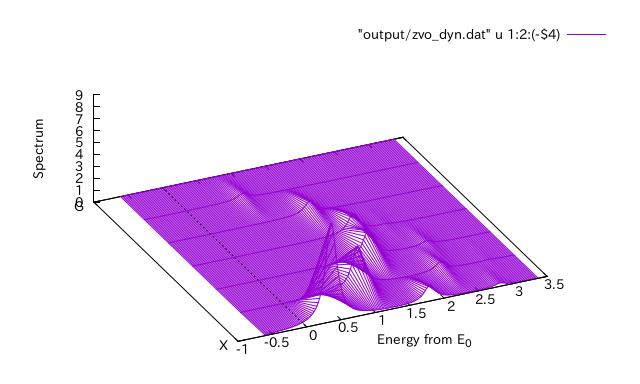

.. _tutorial:

Tutorial for static correlation function
========================================

In this tutorial, we explain through a sample calculation of
the 8-site Hubbard model on the square lattice.

Run HPhi/vmc.out
----------------

- For :math:`{\mathcal H}\Phi`

  We calculate the ground state and the correlation function with
  the following input file
  
  ::
   
     a0w = 2
     a0l = 2
     a1w = -2
     a1l = 2
     model="Hubbard"
     method="CG"
     lattice="square"
     t=1.0
     U=8.0
     nelec = 8
     2Sz=0
  
  .. code-block:: bash

     $ HPhi -s input

- For mVMC

  First, we optimize the trial wavefunction with the following input
  
  ::
   
     a0w = 2
     a0l = 2
     a1w = -2
     a1l = 2
     model="Hubbard"
     lattice="square"
     t=1.0
     U=8.0
     nelec = 8
     2Sz=0
  
  .. code-block:: bash

     $ vmc.out -s input

  We add the following line to the input file to compute the correlation function.

  ::

     NVMCCalMode = 1

  Compute the correlation function.
  
  .. code-block:: bash

     $ vmc.out -s input output/zqp_opt.dat
         
Then the one- and two-body correlation function are written to files
in the ``output/`` directory.

Related files

- StdFace.def (See the manuals for mVMC/:math:`{\mathcal H}\Phi`)
- zqp_opt.dat (See the manual for mVMC)
- greenone.def (:ref:`greenindex`)
- greentwo.def (:ref:`greenindex`)

Fourier transformation of correlation functions
-----------------------------------------------

Perform the Fourier transformation of the correlation function
by using the utility ``greenr2k``.

.. code-block:: bash

   $ echo "4 20
   G 0 0 0
   X 0.5 0 0
   M 0.5 0.5 0
   G 0 0 0
   16 16 1" >> geometry.dat
   $ greenr2k namelist.def geometry.dat
     
Then the Fourier-transformed correlation functions are
written to a file in ``output/``.

Related files

- output/zvo_cisajs_001.dat (:ref:`zvocisajs`)
- output/zvo_cisajs.dat (:ref:`zvocisajs`)
- output/zvo_cisajscktalt_001.dat (:ref:`zvocisajs`)
- output/zvo_cisajscktalt.dat (:ref:`zvocisajs`)
- geometry.dat (:ref:`geometry`)
- output/zvo_corr.dat (:ref:`zvocorr`)

Display correlation functions
-----------------------------

Plot the correlation function in the *k* space
by using gnuplot.

.. code-block:: gnuplot

   load "kpath.gp"
   plot "output/zvo_corr_eigen0.dat" u 1:12 w l

.. _corplotpng:

.. figure:: ../../../figs/corplot.png

   The spin-spin correlation :math:`\langle{\bf S}_{\bf k}\cdot{\bf S}_{\bf k}\rangle`
   (Column 12).

Related files

- kpath.gp (:ref:`gnuplot`)
- output/zvo_corr.dat (:ref:`zvocorr`)

Tutorial for dynamical correlation function
===========================================

In this tutorial, we consider one-dimentional Heisenberg model with 12 sites.

Run HPhi
--------

We compute the ground state and the correlation function.
Input file is as follows:

::
   
   model = Spin
   lattice = Chain
   method = CG
   L = 12
   2Sz = 0
   J = 1.0
   CalcSpec = Scratch
   SpectrumType = SzSz_r
   OmegaIm = 0.1
   OmegaMin = -6.0
   OmegaMax = -2.0

.. code-block:: bash

   $ HPhi -s input

Then, we obtain files for dynamical correlation function in ``output/``.

Releted files

- stan.in (See manual of mVMC/:math:`{\mathcal H}\Phi`)

Fourier transformation of correlation function
----------------------------------------------

Perform Fourier transformation with the utility ``dynamicalr2k``.

.. code-block:: bash

   $ echo "4 20
   G 0 0 0
   X 0.5 0 0
   M 0.5 0.5 0
   G 0 0 0
   1 1 1" >> geometry.dat
   $ dynamicalr2k namelist.def geometry.dat
     
Then, we obtain files for Fourier-transformed dynamical correlation function in ``output/``.

Releted files

- output/zvo_DynamicalGreen.dat
- geometry.dat (:ref:`geometry`)
- output/zvo_dyn.dat

Display correlation function
----------------------------

Plot correlation functions in the :math:`k` space by using gnuplot.

::

   load "kpath.gp"
   splot "output/zvo_dyn.dat" u 1:2:(-$4) w l

.. _dynamicalr2gpng:
     

   Imaginary part of the correlation function :math:`\langle{\bf S}_{\bf k}\cdot{\bf S}_{\bf k}\rangle(\omega)` (fourth column of an output file)

Releted files

- kpath.gp (:ref:`gnuplot`)
- output/zvo_dyn*.dat
