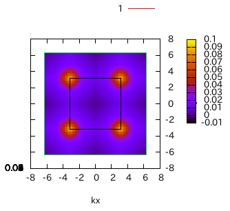

.. _tutorial:

Tutorial
========

This tutorial is done by using the input file
in ``sample/Standard/Spin/HeisenbergSquare/``.

Run HPhi/vmc.out
----------------

- For :math:`{\mathcal H}\Phi`

  Calculate the ground state and the correlation function at that state.
  
  .. code-block:: bash

     $ ../../../../src/HPhi -s StdFace.def

- For mVMC

  Optimize the trial wavefunction.
  
  .. code-block:: bash

     $ ../../../../src/vmc.out -s StdFace.def

  Add the following line in ``StdFace.def`` to compute the correlation function.

  ::

     NVMCCalMode = 1

  Compute the correlation function.
  
  .. code-block:: bash

     $ ../../../../src/vmc.out -s StdFace.def zqp_opt.dat
         
Then the one- and two-body correlation function are written to files
in the ``output/`` directory.

Related files

- StdFace.def (See the manuals for mVMC/:math:`{\mathcal H}\Phi`)
- zqp_opt.dat (See the manual for mVMC)
- greenone.def (:ref:`greenindex`)
- greentwo.def (:ref:`greenindex`)

Fourier transformation of correlation functions
-----------------------------------------------

Perform the Fourier transformation of the correlation function
by using the utility ``fourier``.

.. code-block:: bash

   $ ../../../../tool/fourier namelist.def geometry.dat
     
Then the Fourier-transformed correlation functions are
written to a file in ``output/``.

Related files

- output/zvo_cisajs_001.dat (:ref:`zvocisajs`)
- output/zvo_cisajs.dat (:ref:`zvocisajs`)
- output/zvo_cisajscktalt_001.dat (:ref:`zvocisajs`)
- output/zvo_cisajscktalt.dat (:ref:`zvocisajs`)
- geometry.dat (:ref:`geometry`)
- output/zvo_corr.dat (:ref:`zvocorr`)

Display correlation functions
-----------------------------

Plot the correlation function in the :math:`k` space
by using the utility ``corplot``.

.. code-block:: bash

   $ ../../../../tool/corplot output/zvo_corr.dat

Then the following message appears in the terminal.

::

    #####  Plot Start  #####

       Please specify target number from below (0 or Ctrl-C to exit):

       Real Part Without ErrorBar
         [ 1] Up-Up [ 2] Down-Down [ 3] Density-Density [ 4] SzSz [ 5] S+S- [ 6] S-S+
       Imaginary Part Without ErrorBar
         [11] Up-Up [12] Down-Down [13] Density-Density [14] SzSz [15] S+S- [16] S-S+
       Real Part With ErrorBar
         [21] Up-Up [22] Down-Down [23] Density-Density [24] SzSz [25] S+S- [26] S-S+
       Imaginary Part With ErrorBar
         [31] Up-Up [32] Down-Down [33] Density-Density [34] SzSz [35] S+S- [36] S-S+

       Target : 

Type a number corresponding to the quantity to be plotted (for example ``4``)
and press ``Enter``,
then gnuplot is launched and the 3D figure is displayed (Fig. :num:`corplotpng`).

.. _corplotpng:

            The 3D picture when ``Target : 4``.
            The solid black lines indicate the Brillouin zone.

Related files

- kpoint.dat (:ref:`kpoint`)
- correlation.gp (:ref:`gnuplot`)
- correlation.dat (:ref:`correlation`)
