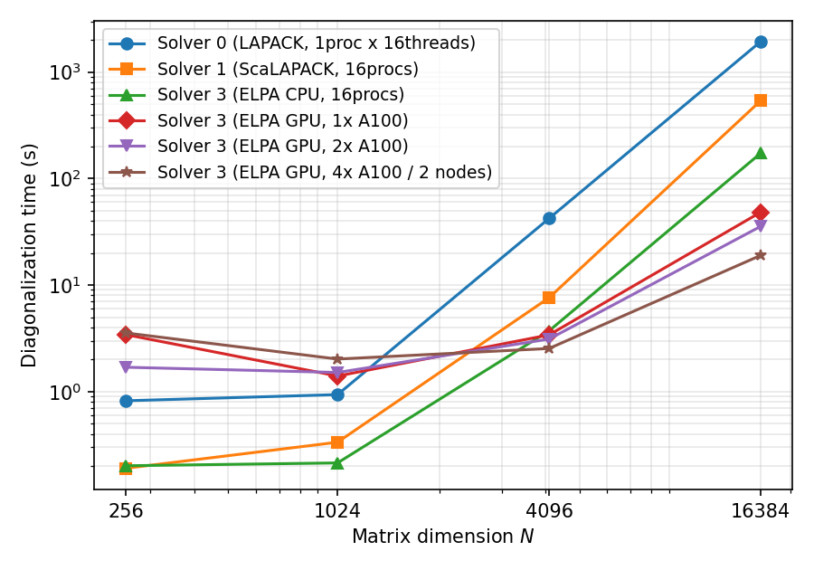
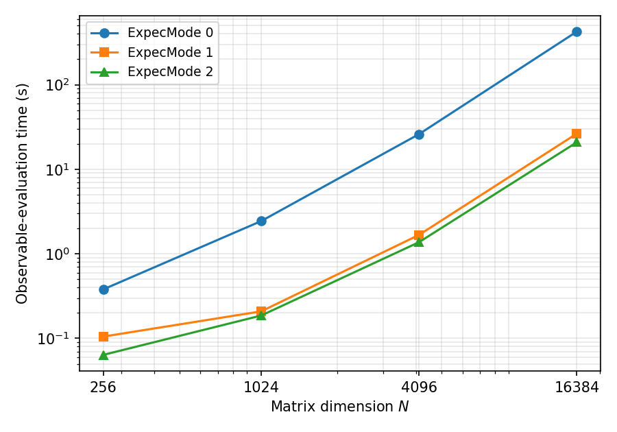

.. highlight:: none

.. _Sec:ParallelFullDiag:

並列全対角化
============

本節では、全対角化 (``method="FullDiag"``) の並列計算で用いられる
アルゴリズムの詳細と、バックエンド間の速度比較を示します。
入力キーワード (``Solver``, ``ExpecMode``, ``NGPU``) の仕様は
:ref:`Subsec:calcmod` を参照してください。

計算の流れ
----------

全対角化は次の4段階で構成されます。

1. **ハミルトニアン行列の生成**: 実空間配置を基底として
   :math:`H_{ij} = \langle \psi_i | \hat{H} | \psi_j \rangle`
   (:math:`N \times N` のエルミート行列) を生成します。
2. **対角化**: ``Solver`` キーワードで選択したバックエンド
   (LAPACK / ScaLAPACK / MAGMA / ELPA) で全固有値・全固有ベクトルを
   求めます。
3. **固有ベクトルの再分散** (``Solver 1``/``3`` の分散実行で
   ``ExpecMode 1``/``2`` を使用する場合): 対角化に適した分散形式から
   物理量評価に適した分散形式へ固有ベクトルを再配置します。
4. **物理量の評価と出力**: 各固有状態 :math:`|\Phi_i\rangle` について
   エネルギー、揺らぎ、Green関数などの期待値
   :math:`\langle \Phi_i | \hat{A} | \Phi_i \rangle` を計算し出力します。
   評価カーネルは ``ExpecMode`` で選択します。

分散ハミルトニアン生成 (Solver 3)
---------------------------------

``Solver 0``/``1``/``2`` では全ランクが :math:`N \times N` 行列全体を
複製して保持するため、1プロセスあたりのメモリは :math:`O(N^2)` です。
``Solver 3`` (ELPA) を複数MPIプロセスで実行した場合は、各ランクが
自分の担当する連続な列ブロック (パネル) のみを生成・保持します。
1ランクあたりのピークメモリは :math:`O(N^2/P)` (:math:`P`: プロセス数)
となり、プロセス数を増やすことでより大きな次元を扱えます。
実測では 8サイトHubbard鎖 (:math:`N=4900`) で、複製形式 (1プロセス)
の 1.93 GB に対し4プロセス分散では 0.63 GB/ランクでした。

生成されたパネルは、ELPA (およびScaLAPACK記述子) が要求する2次元
ブロックサイクリック分散へMPI通信により再配置されます。プロセス
グリッドは :math:`P` からなるべく正方に近い :math:`n_{\rm prow} \times
n_{\rm pcol}` を選びます。行列次元 :math:`N` がグリッド次元
:math:`\max(n_{\rm prow}, n_{\rm pcol})` より小さい場合は、ELPA
対角化の前にランク数を減らすよう促すエラーで停止します。

ELPA による対角化
-----------------

ELPA (Eigenvalue soLvers for Petaflop Applications) は密行列固有値
問題のための並列ライブラリで、ScaLAPACKと同じ2次元ブロック
サイクリック分散を用いつつ、より高い並列効率を実現します。
:math:`{\mathcal H}\Phi` は複素エルミート行列ソルバーを使用します。
1-stage/2-stage アルゴリズムは :math:`{\mathcal H}\Phi` 側で選択
します: GPU 実行では常に 1-stage を、CPU 実行ではブロックサイズが
既定値まで取れる場合に 2-stage、プロセスグリッドに対して行列が
小さくブロックサイズが制限される場合は 1-stage を使用します。
``NGPU`` :math:`\geq 1` を指定すると GPU 版が有効になり、プロセス
とGPUの対応はELPAが自動割当します (1プロセス1GPUの起動構成を推奨、
ELPA 2023.11.001 以降が必要)。``NGPU`` は有効化フラグであり使用
デバイスを物理的に制限しないため、割当の制御はスケジューラや
``CUDA_VISIBLE_DEVICES`` で行ってください。

状態タスク並列の物理量評価 (ExpecMode 1)
----------------------------------------

従来の評価方法 (``ExpecMode 0``) では、固有状態を1つずつ全ランクで
共有しながら評価するため、状態ごとにMPI集団通信 (固有ベクトルの
収集・縮約) が発生します。状態数は :math:`N` に等しいため、特に
マルチノード実行ではこの通信が支配的になります。

``ExpecMode 1`` では、対角化後に固有ベクトルを「状態パネル」形式
(各ランクが連続な固有状態ブロックを所有) へ再分散し、各ランクが
自分の担当状態を **通信なしで独立に** 評価します。物理量
(``zvo_phys*.dat``) はランクごとの部分結果を最後に1回だけ収集
します。集約Green関数出力 (``OutputGreenFormat 1``) はランクごとの
パーシャルファイルに書き出し、全ランクのマニフェストが成功を報告
した時点でランク0が一時ファイルへのマージとリネームによる
トランザクショナルな公開を行います (途中失敗時に不完全な最終
ファイルが公開されるのを避ける設計です)。

トレースカーネル評価 (ExpecMode 2)
----------------------------------

``ExpecMode 1`` でも、一体・二体Green関数の評価は「状態ごとに演算子
を作用させる」ループであり、演算子あたりの基底走査オーバーヘッドを
状態数 :math:`N` 回支払います。``ExpecMode 2`` は、各演算子
:math:`\hat{A}` について基底状態の写像 (作用先の状態インデックス
:math:`k \to k'` と振幅) を **1回だけ** 前計算し、所有する全固有状態
をその写像に対する密なストリーミングループで評価します。これにより
演算子あたりのオーバーヘッドが状態数に対して償却され、一体・二体
Green関数を多数の固有状態について評価する場合に有効です。

これら2つのGreen関数カーネルの対応モデルは ``Hubbard``/``HubbardGC``
およびスピン1/2の ``Spin``/``SpinGC`` です。未対応モデルや実行時条件
(N体Green関数との評価器共有、演算子未定義、結果バッファ上限
``HPHI_TRACE_BUF_MAX_MB`` 超過) に該当する物理量は自動的に
``ExpecMode 1`` の経路へフォールバックし、その判定は物理量評価の
直前に ``INFO`` 行で報告されます。

本バージョンより、``ExpecMode 2`` はエネルギー・ゆらぎ系 (``var`` 列
を含む) についても、別のCSR (圧縮行格納) カーネルでトレースします:
ハミルトニアンを1ランクあたり1回だけコンパクトな疎行列へ前計算し、
所有する全固有状態を、通常の ``mltply`` 型の走査の代わりに疎行列
ベクトル積でストリーミング評価します。上記のGreen関数カーネルとは
異なり、エネルギー系は上記の対応4行に限定されず、``FullDiag`` が
実行できる全てのモデルに対応しています。フォールバックする理由も
次の2つのみです: ハミルトニアンが ``InputHam`` から読み込まれた
場合、または1ランクあたりのCSRバッファが ``HPHI_TRACE_BUF_MAX_MB``
(Green関数の結果バッファと共通の上限) を超える場合です。``S2``、
``NBodyG``、``AnomalousG`` は本バージョンでも ``ExpecMode 1`` の
経路のままです。詳細なフォールバック分類と正確な ``INFO`` の文言は
:ref:`Subsec:calcmod` の ``ExpecMode`` の項を参照してください。

**なぜCSRハミルトニアンを各ランクに複製するのか。** 状態パネル形式
では、各ランクが *完全な* 固有ベクトルのブロックを所有し、状態ごと
のループ内で通信せずに評価します (これが ``ExpecMode 1``/``2`` の
核心です)。ローカルに完結した :math:`x` について
:math:`y = H x` を計算するには、そのランクに :math:`H` の全行が必要
なので、CSRは各ランクで全列範囲について構築されます。CSRを分散
(各ランクが :math:`N/P` 行、非ゼロで約 :math:`\mathrm{nnz}/P` 個のみ
を保持) すると、分散した
演算子をローカルの完全ベクトルに作用させるために状態ごとの通信が
発生し、状態パネル設計が除去したはずの集団通信コストが復活して
しまいます。したがって1ランクあたりのCSRは :math:`P` を増やしても
小さくなり **ません**。とはいえCSRはコンパクトです: 疎行列であり、
発行される要素数 :math:`\mathrm{nnz} \approx T \cdot N`
(:math:`T` は1列あたりに寄与するハミルトニアン項の数) で、固定
モデルでは :math:`N` にほぼ比例します (:math:`T` 自体も系のサイズに
対してゆるやかにしか増えません。例: Hubbard鎖 :math:`L=10` で
:math:`T \approx 21`、:math:`L` サイト横磁場スピン鎖で
:math:`T \approx L+1`)。バッファ容量とメモリゲートはこの発行要素数
に合わせて確保・判定されます (重複を合算した後の要素数
:math:`\mathrm{rowptr}[N]` はこれより小さくなり得ます)。支配的な
``colidx``/``val`` の格納は :math:`\approx 24 \times \mathrm{nnz}`
バイト
(加えて :math:`O(N)` の行ポインタ・作業ベクトル・対角係数配列) で、
:math:`N = 63504` で約 32 MB です。中程度のランク数では、これは
:math:`O(N^2/P)` の固有ベクトル状態パネルよりずっと小さいですが、
CSRは :math:`P` に依存しない一方でパネルは :math:`P` で小さくなる
ため、:math:`P` を増やすにつれてCSRの固定コストの相対的な比重が
大きくなり、:math:`P` が十分大きい場合 (あるいは演算子密な入力では
中程度の :math:`P` でも) 支配的になり得ます。予測されるCSRサイズが
1ランクあたりの ``HPHI_TRACE_BUF_MAX_MB`` ゲートを超える場合は、
エネルギー系が ``ExpecMode 1`` へフォールバックし、それを報告します。

速度比較
--------

シングルノード
~~~~~~~~~~~~~~

横磁場付きスピン1/2鎖 (``model="SpinGC"``, ``lattice="chain"``,
:math:`J=1`, :math:`\Gamma=0.5`, :math:`L=8,10,12,14`, 次元
:math:`N=2^L=256,\dots,16384`) を、物性研スパコン kugui (AMD EPYC
7763、Intel コンパイラ + Intel MPI + MKL) の1ノードで測定しました。
CPU 構成は全て合計16コアに揃えています: ``Solver 0`` は1プロセス
:math:`\times` 16スレッド、``Solver 1``/``3`` は16プロセス
:math:`\times` 1スレッドです。GPU は同システムの GPU ノード
(EPYC 7763 + NVIDIA A100-SXM4-40GB :math:`\times` 2/ノード) で測定し、
1プロセス1GPU構成を使用します: 1枚=1プロセス (``NGPU 1``)、
2枚=1ノード2プロセス (``NGPU 2``)、4枚=2ノード :math:`\times`
2プロセス (``NGPU 2``、ノード間は InfiniBand + Intel MPI)。

対角化時間 (``CalcTimer.dat`` の ``LapackDiag`` 区分、秒):

.. csv-table::
   :header: ":math:`N`", "Solver 0 (LAPACK)", "Solver 1 (ScaLAPACK)", "Solver 3 (ELPA, CPU)", "Solver 3 (GPU :math:`\times` 1)", "Solver 3 (GPU :math:`\times` 2)", "Solver 3 (GPU :math:`\times` 4, 2ノード)"
   :widths: 10, 16, 16, 16, 14, 14, 14

   "256", "0.82", "0.19", "0.20", "3.42", "1.69", "3.55"
   "1024", "0.94", "0.33", "0.21", "1.40", "1.51", "2.02"
   "4096", "42.22", "7.60", "3.72", "3.41", "3.11", "2.54"
   "16384", "1929.6", "536.9", "172.6", "48.23", "35.51", "18.97"

   対角化時間の行列サイズ :math:`N` 依存性 (両対数)。

:math:`N=16384` では ``Solver 3`` (ELPA CPU、16プロセス) は
``Solver 0`` (LAPACK) の約11倍、``Solver 1`` (ScaLAPACK) の約3.1倍
高速です。GPU は :math:`N` が小さい間は初期化・転送のオーバー
ヘッドで不利ですが、:math:`N \sim 4000` で CPU 16コアと並び、
:math:`N=16384` では GPU 1枚で ELPA CPU の約3.6倍 (LAPACK の
約40倍)、2枚で約4.9倍 (同約54倍)、2ノード4枚では約9.1倍
(同約102倍) に達します。2枚 :math:`\to` 4枚 (ノード間) の
スケーリングは約1.87倍とほぼ理想的です。一方 :math:`N \lesssim
4000` では GPU を増やしても改善せず、GPU 枚数は行列サイズに
見合った分だけ増やすのが得策です。

物理量評価時間 (``Solver 3`` CPU 16プロセス、全状態の一体・二体
Green関数を集約形式で出力、``CalcTimer.dat`` の ``CalcPhys`` 区分、秒):

.. csv-table::
   :header: ":math:`N`", "ExpecMode 0", "ExpecMode 1", "ExpecMode 2"
   :widths: 10, 20, 20, 20

   "256", "0.38", "0.11", "0.06"
   "1024", "2.44", "0.21", "0.19"
   "4096", "26.00", "1.67", "1.37"
   "16384", "424.5", "26.40", "20.84"

   物理量評価時間の行列サイズ :math:`N` 依存性 (両対数)。

:math:`N=16384` では ``ExpecMode 1`` は ``ExpecMode 0`` の約16倍
(プロセス数どおりのスケーリング)、``ExpecMode 2`` はトレース
カーネルによりさらに約1.3倍高速です。

マルチノード
~~~~~~~~~~~~

8サイトHubbard鎖 (:math:`N=4900`)、全状態の一体・二体Green関数出力
付き、``Solver 3`` (CPU)、kugui の2ノード :math:`\times` 4プロセス
(AMD EPYC 7763、InfiniBand接続、Intel MPI) での全体実行時間:

.. csv-table::
   :header: "ExpecMode", "実行時間 (2ノード8プロセス)"
   :widths: 20, 30

   "0 (従来)", "11分52秒"
   "1 (状態タスク並列)", "52秒"
   "2 (トレースカーネル)", "49秒"

``ExpecMode 0`` の実行時間は状態ごとのノード間集団通信 (固有
ベクトル収集と縮約 :math:`\times N` 状態) に支配されており、
``ExpecMode 1``/``2`` はまさにこのコストを除去します (約14倍)。
マルチノード実行では ``ExpecMode 1`` 以上の使用を強く推奨します。

必要メモリの目安
~~~~~~~~~~~~~~~~

複素倍精度の :math:`N \times N` 行列1個は :math:`16 N^2` バイト
です。ピーク時の必要メモリはソルバーごとに次が目安です (係数は
kugui での実測 MaxRSS に基づく経験値で、MPI ランタイム等の固定
オーバーヘッドは含みません):

* ``Solver 0``/``2``: 行列と固有ベクトルを各プロセスが複製保持
  するため、**1プロセスあたり** 約 :math:`32 N^2` バイト。
* ``Solver 1``: 対角化は分散ですが、行列の生成は複製方式のため
  **1プロセスあたり** 約 :math:`16 N^2 + 32 N^2 / P` バイト
  (:math:`P`: プロセス数)。生成の複製分が支配的で、大きな
  :math:`N` では ``Solver 3`` より多くのメモリを要します。
* ``Solver 3`` (CPU): 生成も分散のため **ジョブ全体で** 約
  :math:`64 N^2` バイト (行列コピー約4個分、1プロセスあたり
  :math:`64 N^2 / P`)。
* ``Solver 3`` (GPU): 上記のホストメモリに加えて **1 GPU あたり**
  約 :math:`40 N^2 / P` バイトのデバイスメモリ (complex の行列+
  固有ベクトル+三重対角段の実数ワークスペース)。

.. csv-table::
   :header: ":math:`N`", "Solver 0 (1プロセス)", "Solver 3 CPU (ジョブ全体)", "Solver 3 GPU (1GPUあたり, :math:`P=4`)"
   :widths: 12, 22, 22, 26

   "16,384", "8.6 GB", "17 GB", "2.7 GB"
   "63,504", "129 GB", "258 GB", "40 GB (A100 40GB の限界)"
   "200,000", "1.3 TB", "2.6 TB", "400 GB (:math:`P=4` では不可)"

最大サイズの目安
~~~~~~~~~~~~~~~~

到達可能な行列次元 :math:`N` は主にメモリで決まります (kugui での
実測に基づく目安):

* **CPU (Solver 3)**: ピーク時にジョブ全体で約 :math:`64 N^2` バイト
  (行列コピー約4個分) を要します。実測では :math:`N=63504`
  (10サイトHubbard鎖) が4ノード (128プロセス) で対角化23分・
  約67 GB/ノードで完了しました (16ランク基準の並列効率 ~91%)。
  この模型から外挿すると、16ノード (約3.8 TB) で
  :math:`N \sim 2 \times 10^5` 程度 (対角化 ~3時間) が実用上限です。
* **GPU (Solver 3)**: 行列・固有ベクトルはデバイスメモリにも分散
  されます。ELPA (2025.06) の complex 1-stage 経路では 1 GPU あたり
  約 :math:`40 N^2 / P` バイト (complex の行列+固有ベクトルに加え、
  三重対角段の実数ワークスペース) がピークです。A100 40GB
  :math:`\times 4` では :math:`N=48620` は動作 (対角化 199秒)、
  :math:`N=63504` はデバイスメモリ超過で停止しました (このモデル
  の境界予測 :math:`N \approx 6.2 \times 10^4` と整合)。上限は
  GPU 枚数 :math:`P` とともに :math:`\sqrt{P}` で伸びます。
  利用できる GPU 数を超える次元は CPU ノードを使用してください。

使い分けの指針
~~~~~~~~~~~~~~

* 1プロセスで収まる小規模系では ``Solver 0`` (LAPACK) が最も手軽です。
* 数千次元以上・複数プロセスでは ``Solver 3`` (ELPA) が対角化速度と
  メモリ (分散ハミルトニアン生成による :math:`O(N^2/P)`) の両面で
  有利です。GPUが利用可能であれば ``NGPU`` の指定でさらに加速
  できます。なお ``ExpecMode 1``/``2`` による物理量評価の高速化は
  分散実行の ``Solver 1`` でも利用できます。
* 物理量評価は、対応モデルであれば ``ExpecMode 2``、それ以外は
  ``ExpecMode 1`` を推奨します (結果は ``ExpecMode 0`` と一致します)。
